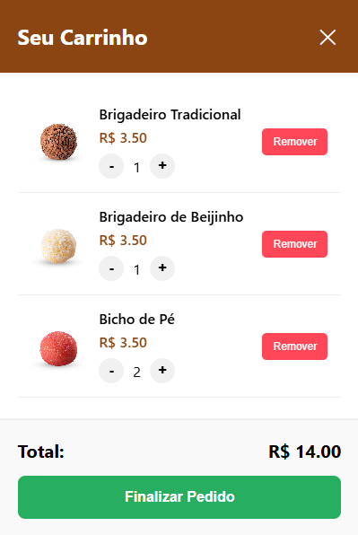

<div align="center">
  
# 🌟 Pedaço do Céu

### E-commerce moderno com integração completa ao Mercado Pago

[](https://pedaco-do-ceu-app.vercel.app/)
[](LICENSE)
[](https://nodejs.org/)
[](https://vercel.com)

**[🔗 Ver Demo](https://pedaco-do-ceu-app.vercel.app/)** • **[📖 Documentação](#-funcionalidades)** • **[🚀 Como Usar](#️-como-executar)**

</div>

---

## 📋 Sobre o Projeto

**Pedaço do Céu** é uma plataforma de e-commerce construída do zero, demonstrando habilidades em desenvolvimento web moderno, integração de APIs de pagamento e arquitetura serverless.

### 💡 Por que este projeto?

Desenvolvido tanto como **solução real de negócio** este projeto demonstra competências essenciais:

<table>
  <tr>
    <td align="center">💳</td>
    <td><b>Pagamentos</b><br/>Integração completa com Mercado Pago</td>
    <td align="center">⚡</td>
    <td><b>Serverless</b><br/>Arquitetura escalável com Vercel</td>
  </tr>
  <tr>
    <td align="center">🎨</td>
    <td><b>UI/UX</b><br/>Interface responsiva e intuitiva</td>
    <td align="center">🔒</td>
    <td><b>Segurança</b><br/>Transações financeiras protegidas</td>
  </tr>
  <tr>
    <td align="center">📊</td>
    <td><b>Real-time</b><br/>Status de pagamentos instantâneo</td>
    <td align="center">🌐</td>
    <td><b>Deploy</b><br/>CI/CD automatizado</td>
  </tr>
</table>

---

## 🚀 Tecnologias Utilizadas

<div align="center">

### Frontend


### Backend


### Integrações


</div>

<details>
<summary><b>📦 Detalhes das Tecnologias</b></summary>

#### Frontend
- **JavaScript Vanilla** - Performance otimizada sem dependências desnecessárias
- **HTML5 & CSS3** - Estrutura semântica e design responsivo
- **Fetch API** - Comunicação assíncrona com backend

#### Backend
- **Node.js** - Runtime JavaScript server-side
- **Vercel Serverless Functions** - Escalabilidade automática e zero configuração
- **Mercado Pago SDK** - Integração oficial para processamento de pagamentos

#### DevOps & Tools
- **Vercel** - Deploy contínuo e hospedagem
- **Git & GitHub** - Controle de versão e colaboração
- **Environment Variables** - Gestão segura de credenciais

</details>

---

## ✨ Funcionalidades

<table>
  <tr>
    <td>
      
    </td>
    <td>
      <b>Catálogo de Produtos</b><br/>
      Exibição dinâmica e organizada de produtos
    </td>
  </tr>
  <tr>
    <td>
      
    </td>
    <td>
      <b>Carrinho de Compras</b><br/>
      Gerenciamento de itens em tempo real
    </td>
  </tr>
  <tr>
    <td>
      
    </td>
    <td>
      <b>Checkout Seguro</b><br/>
      Integração completa com Mercado Pago
    </td>
  </tr>
  <tr>
    <td>
      
    </td>
    <td>
      <b>PIX & Cartão</b><br/>
      Múltiplos métodos de pagamento disponíveis
    </td>
  </tr>
  <tr>
    <td>
      
    </td>
    <td>
      <b>Verificação de Status</b><br/>
      Confirmação automática de pagamentos
    </td>
  </tr>
  <tr>
    <td>
      
    </td>
    <td>
      <b>Notificações</b><br/>
      Feedback em tempo real para o usuário
    </td>
  </tr>
  <tr>
    <td>
      
    </td>
    <td>
      <b>Design Responsivo</b><br/>
      Experiência otimizada em todos os dispositivos
    </td>
  </tr>
</table>

---

## 🎯 Diferenciais Técnicos

### 🏗️ Arquitetura Serverless


**Vantagens:**
- ✅ Escalabilidade automática sob demanda
- ✅ Custos otimizados (pay-per-use)
- ✅ Zero manutenção de servidores
- ✅ Deploy instantâneo

### 🔐 Segurança
```javascript
✓ Tokens de acesso via variáveis de ambiente
✓ Validação de dados no backend
✓ CORS configurado adequadamente
✓ Nenhuma credencial exposta no frontend
✓ Sanitização de inputs
✓ HTTPS obrigatório
```

### 📐 Boas Práticas

- 📝 Código limpo e bem documentado
- 🐛 Tratamento robusto de erros
- 📊 Logs estruturados para debugging
- 🎯 Separação clara de responsabilidades
- ♻️ Código reutilizável e modular
- 🧪 Testável e manutenível

---

## 🛠️ Como Executar

### Pré-requisitos

- Node.js >= 18.0.0
- npm ou yarn
- Conta no Mercado Pago Developers

### 📥 Instalação
```bash
# Clone o repositório
git clone https://github.com/peumariano/pedaco-do-ceu.git

# Entre no diretório
cd pedaco-do-ceu

# Instale as dependências
npm install
```

### ⚙️ Configuração

1. Crie um arquivo `.env` na raiz do projeto:
```env
MERCADOPAGO_ACCESS_TOKEN=seu_token_aqui
```

2. Obtenha suas credenciais no [Mercado Pago Developers](https://www.mercadopago.com.br/developers)

### 🚀 Executar Localmente
```bash
# Modo desenvolvimento
vercel dev

# Acesse http://localhost:3000
```

### 🌐 Deploy em Produção
```bash
# Deploy na Vercel
vercel --prod
```

---

## 📝 Configuração do Mercado Pago

<details>
<summary><b>Passo a passo completo</b></summary>

1. **Criar Conta**
   - Acesse [Mercado Pago Developers](https://www.mercadopago.com.br/developers)
   - Crie ou faça login na sua conta

2. **Obter Credenciais**
   - Vá em "Suas integrações"
   - Crie uma nova aplicação
   - Copie o `Access Token` (Produção ou Teste)

3. **Configurar no Vercel**
   - Acesse o projeto no Vercel
   - Vá em Settings → Environment Variables
   - Adicione: `MERCADOPAGO_ACCESS_TOKEN`
   - Cole o token e salve

4. **Pronto!** 🎉
   - Faça um novo deploy
   - O sistema está operacional

</details>

---

## 🚧 Roadmap

### 🎯 Próximas Features

- [ ] 👤 **Painel Administrativo** - Gestão completa de produtos e pedidos
- [ ] 🔐 **Sistema de Autenticação** - Login e cadastro de usuários
- [ ] 💾 **Banco de Dados** - Persistência de dados com MongoDB/PostgreSQL
- [ ] 📜 **Histórico de Pedidos** - Acompanhamento de compras anteriores
- [ ] 🎟️ **Cupons e Descontos** - Sistema promocional
- [ ] 📧 **Notificações** - Email/WhatsApp automático
- [ ] 📊 **Dashboard Analytics** - Métricas e relatórios de vendas
- [ ] ⭐ **Sistema de Avaliações** - Reviews de produtos
- [ ] 🔍 **Busca Avançada** - Filtros e categorias
- [ ] 📱 **App Mobile** - React Native

---

## 📊 Status do Projeto

<div align="center">


</div>

---

## 📸 Screenshots

<div align="center">

### 🏠 Página Inicial


### 🛒 Carrinho de Compras


</div>

---

## 🤝 Contribuindo

Contribuições são sempre bem-vindas! Se você quer contribuir:

1. Faça um Fork do projeto
2. Crie uma Branch para sua Feature (`git checkout -b feature/AmazingFeature`)
3. Commit suas mudanças (`git commit -m 'Add some AmazingFeature'`)
4. Push para a Branch (`git push origin feature/AmazingFeature`)
5. Abra um Pull Request

---

## 📄 Licença

Este projeto está sob a licença MIT. Veja o arquivo [LICENSE](LICENSE) para mais detalhes.
